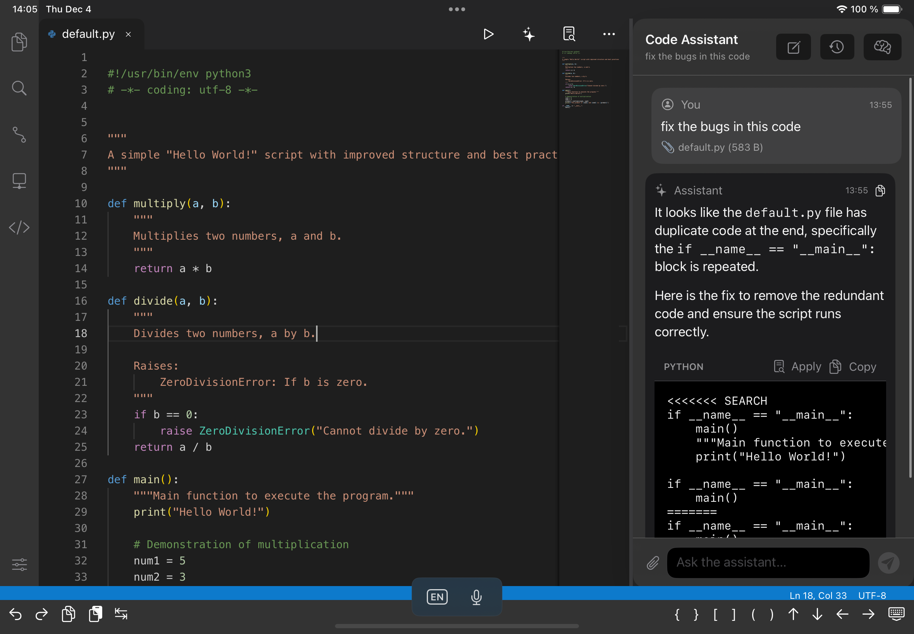

# Code App

Bringing desktop-like editing experience to iPad, available on [App Store](https://apps.apple.com/us/app/code-app/id1512938504) and [TestFlight](https://testflight.apple.com/join/EgZ8sE2P).

## About the repository

This repository contains the source code of the app. We also work on issues, listen to your feedback and publish our development plan here.

## Documentation

See [code.thebaselab.com](https://code.thebaselab.com)

## The Plan

Use [VS Code](https://github.com/microsoft/vscode) as a design template while providing key functionalities with [monaco-editor](https://github.com/microsoft/monaco-editor) and native code:

- Version Control (Git clone, commits, diff editor, push, pull and gutter indicator) ✅
- Embeded terminal (70+ commands avaliable) ✅
- Local web development environment (Node + PHP) ✅
- Built in Python runtime ✅
- C/C++ Runtime with WebAssembly (with clang) ✅
- Local Java (OpenJDK) ✅
- SSH Support ✅
- [LSP](https://microsoft.github.io/language-server-protocol) support (Python & Java) ✅ 

## Building the project

1. `git clone https://github.com/thebaselab/codeapp`
2. `./downloadFrameworks.sh`
3. Open Code.xcodeproj
4. Switch to CodeUI target if you wish to run the app on a simulator
5. Click build

The source code of the built-in languages are hosted on these repositories.
| Language | Repository |
|-----------------|-------------------|
| Python 3.9.2 | [cpython](https://github.com/holzschu/cpython/tree/3.9)|
| Clang 14.0.0 | [llvm-project](https://github.com/holzschu/llvm-project)|
| PHP 8.3.2 | [php-src](https://github.com/bummoblizard/php-src/tree/PHP-8.3.2)|
| Node.js 18.19.0 | [nodejs-mobile](https://github.com/1Conan/nodejs-mobile)|
| OpenJDK 8 | [android-openjdk-build-multiarch](https://github.com/thebaselab/android-openjdk-build-multiarch)|

## AI Code Assistant

Code App features a built-in AI code assistant that helps you write, refactor, and debug code directly in the editor. The assistant supports multiple AI providers including OpenAI, Anthropic, and OpenRouter, allowing you to choose the model that best fits your needs.

### Features

- **Intelligent Code Editing**: The assistant uses structured SEARCH/REPLACE blocks to precisely locate and modify code, ensuring accurate edits even with formatting differences
- **Multi-Provider Support**: Choose from OpenAI, Anthropic, or OpenRouter with support for custom models
- **Context-Aware**: Automatically includes your current selection and file context in conversations
- **Smart Code Matching**: Advanced algorithms match AI-generated code to the correct location in your files using structural anchors and fuzzy matching
- **Conversation History**: Keep track of your coding sessions with persistent chat history
- **File Attachments**: Attach files to provide additional context for the assistant

The assistant integrates seamlessly with the editor, allowing you to apply code changes with a single click while maintaining full control over your codebase.
